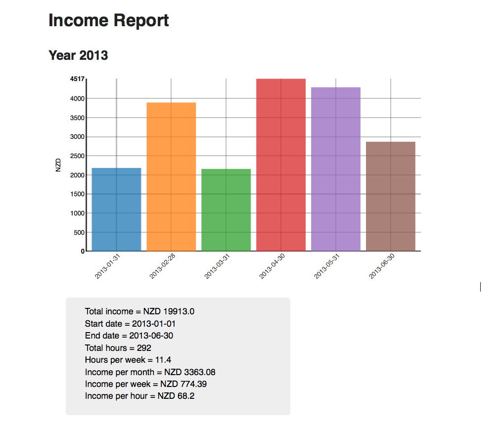

README
=======
This is a little Python 2.7 command-line program to make HTML income 
reports given a list of CSV files of income items.

The first (header) row of each given CSV file will be ignored.
Only the first three columns of each given CSV file will be processed
(extra columns will be ignored),
and these columns should contain the following elements 
(separated by commas) in the order listed.

1. The date the income was received (yyyy-mm-dd)
2. The amount of income received (without currency symbols such as '$')
3. The number of hours worked for that income

Assumes one currency type is used throughout the files, such as New Zealand
dollars.

Uses Pandas for data manipulation and a local copy of NVD3 
for Javascript charts.

Authors
--------
- Alex Raichev (2013-05-26)

Todo
-----
- Add doctest examples
- Doctest

Screenshot
----------

